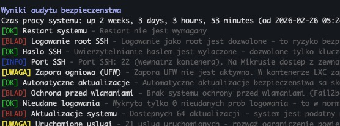

# Mikrus Audit - Skrypt audytu bezpieczenstwa VPS

> **Fork projektu [vps-audit](https://github.com/vernu/vps-audit)** autorstwa [vernu](https://github.com/vernu) - swietnego narzedzia do audytu bezpieczenstwa VPS.
>
> Ten fork dodaje pelne tlumaczenie na jezyk polski, adaptacje do srodowiska **[Mikr.us](https://mikr.us)** (kontenery LXC/Proxmox) oraz poprawki bledow z oryginalnego skryptu.
> Oryginalny skrypt (angielski, uniwersalny) jest nadal dostepny jako `vps-audit.sh`.



## Co sprawdza

### Bezpieczenstwo

- **Konfiguracja SSH**
  - Status logowania root
  - Uwierzytelnianie haslem
  - Niestandardowy port SSH
- **Zapora ogniowa** (UFW, firewalld, iptables, nftables)
- **Ochrona przed wlamaniami** (Fail2ban, CrowdSec) - takze w kontenerach Docker
- **Nieudane proby logowania** - wykrywanie atakow brute force
- **Aktualizacje systemu** - sprawdzanie dostepnych poprawek
- **Uruchomione uslugi** - analiza powierzchni ataku
- **Otwarte porty** - wykrywanie nasluchujacych uslug
- **Logowanie sudo** - sprawdzanie audytu polecen
- **Polityka hasel** - weryfikacja wymagan zlozonosci
- **Pliki SUID** - wykrywanie podejrzanych plikow
- **Automatyczne aktualizacje** (unattended-upgrades)
- **Uprawnienia plikow systemowych** (/etc/shadow, /etc/passwd itp.)
- **Konta z pustymi haslami**

### Wydajnosc

- Uzycie dysku
- Uzycie pamieci RAM
- Uzycie CPU
- Otwarte polaczenia sieciowe

### Specyficzne dla Mikr.us

- **Wykrywanie kontenera LXC** - automatyczne dostosowanie wynikow
- **Sprawdzanie IPv6** - kluczowe dla Mikrusa (IPv6-first)
- **Weryfikacja nasluchiwania na IPv6** - czy uslugi sluchaja na `[::]`
- **Kontekst portow Mikrusa** - informacja o schemacie 10000+ID / 20000+ID / 30000+ID
- **Load Average** - ostrzezenie ze w LXC pokazuje obciazenie hosta, nie kontenera
- **Status Dockera** - kontenery, obrazy, nieuzywane zasoby
- **Dostosowane progi** - inne limity dla kontenerow LXC (RAM, liczba uslug)
- **Linki do dokumentacji Mikrusa** w wynikach

## Wymagania

- System Linux (Ubuntu/Debian zalecany)
- Dostep root lub uprawnienia sudo
- Podstawowe pakiety (zwykle preinstalowane): `ss`, `grep`, `awk`, `curl`

## Instalacja

### Szybka instalacja (jednolinijkowa)

```bash
curl -sL https://raw.githubusercontent.com/simplybychris/vps-audit/main/mikrus-audit.sh | sudo bash
```

### Standardowa instalacja

1. Pobierz skrypt:

```bash
wget https://raw.githubusercontent.com/simplybychris/vps-audit/main/mikrus-audit.sh
# lub
curl -O https://raw.githubusercontent.com/simplybychris/vps-audit/main/mikrus-audit.sh
```

2. Nadaj uprawnienia do uruchomienia:

```bash
chmod +x mikrus-audit.sh
```

## Uzycie

Uruchom skrypt z uprawnieniami root:

```bash
sudo ./mikrus-audit.sh
```

Skrypt:

1. Wykona wszystkie sprawdzenia bezpieczenstwa
2. Wyswietli wyniki na biezaco z kolorowaniem:
   - `[OK]` - Test przeszedl pomyslnie
   - `[UWAGA]` - Wykryto potencjalne problemy
   - `[BLAD]` - Znaleziono krytyczne problemy
   - `[INFO]` - Informacja kontekstowa (specyficzna dla Mikrusa)
3. Wygeneruje raport: `mikrus-audit-raport-[ZNACZNIK_CZASU].txt`

## Format wynikow

Skrypt generuje dwa rodzaje wynikow:

1. Wyniki na zywo w konsoli z kolorowaniem:

```
[OK] Logowanie root SSH - Logowanie jako root jest prawidlowo wylaczone
[UWAGA] Port SSH - Uzyto domyslnego portu 22 - rozważ zmiane
[BLAD] Zapora ogniowa - Zapora UFW nie jest aktywna - system narazony
[INFO] Porty Mikrus - Z zewnatrz dostepne sa tylko porty przekierowane
```

2. Plik raportu zawierajacy:
   - Wyniki wszystkich testow
   - Konkretne zalecenia dla nieudanych testow
   - Statystyki zasobow systemowych
   - Znacznik czasu audytu

## Progi

### Zasoby systemowe

| Zasob | OK | UWAGA | BLAD |
|-------|--------|---------|-------|
| Dysk | < 50% | 50-80% | > 80% |
| Pamiec (VPS) | < 50% | 50-80% | > 80% |
| Pamiec (LXC/Mikrus) | < 60% | 60-85% | > 85% |
| CPU | < 50% | 50-80% | > 80% |

### Bezpieczenstwo

| Test | OK | UWAGA | BLAD |
|------|--------|---------|-------|
| Nieudane logowania | < 10 | 10-50 | > 50 |
| Uruchomione uslugi (VPS) | < 20 | 20-40 | > 40 |
| Uruchomione uslugi (LXC) | < 25 | 25-40 | > 40 |
| Otwarte porty (VPS) | < 10 | 10-20 | > 20 |
| Otwarte porty (LXC) | < 15 | 15-25 | > 25 |

## Roznice wzgledem oryginalnego vps-audit

| Cecha | vps-audit | mikrus-audit |
|-------|-----------|--------------|
| Jezyk | angielski | polski |
| Srodowisko | standardowy VPS | VPS + LXC/Proxmox (Mikr.us) |
| Statusy | PASS/WARN/FAIL | OK/UWAGA/BLAD + INFO |
| IPv6 | brak | sprawdzanie adresu i uslug |
| Docker | czesciowo | pelne sprawdzenie + czyszczenie |
| Progi LXC | brak | dostosowane do kontenerow |
| Load Average | standardowy | z ostrzezeniem o LXC |
| Uprawnienia plikow | brak | sprawdzanie /etc/shadow itp. |
| Puste hasla | brak | wykrywanie kont bez hasel |
| Porty Mikrus | brak | kontekst schematu portow |
| Parsowanie IPv6 | blad w awk -F':' | poprawione (sed) |
| SUID timeout | brak (moze wisiec) | timeout 15/30s |
| Test SSH | brak | test dostepnosci portu |
| Kontenery Docker | tylko fail2ban/crowdsec | pelny status + awarie |
| Polityka hasel | zawsze FAIL bez pwquality | kontekstowa (uwzglednia klucze SSH) |
| Wskazowki | brak | linki do dokumentacji Mikrusa |

## Dobre praktyki

1. Uruchamiaj audyt regularnie (np. co tydzien)
2. Przegladaj wygenerowany raport dokladnie
3. Napraw natychmiast wszystkie testy ze statusem `[BLAD]`
4. Zbadaj testy ze statusem `[UWAGA]` podczas konserwacji
5. Na Mikrusie zwracaj szczegolna uwage na:
   - Konfiguracje SSH (klucze zamiast hasel!)
   - Nasluchiwanie uslug na IPv6
   - Uzycie pamieci RAM (ograniczona w kontenerach)

## Ograniczenia

- Zaprojektowany glownie dla systemow Debian/Ubuntu
- Wymaga dostepu root/sudo
- Niektore testy moga wymagac dostosowania do specyficznego srodowiska
- Nie zastepuje profesjonalnego audytu bezpieczenstwa
- W kontenerach LXC niektore polecenia systemowe moga byc ograniczone

## Podziekowania i atrybucja

Ten projekt jest forkiem **[vps-audit](https://github.com/vernu/vps-audit)** autorstwa **[vernu](https://github.com/vernu)**.

Oryginalny skrypt to swietne, proste narzedzie do audytu bezpieczenstwa VPS.
Ten fork rozszerza go o polskie tlumaczenie i adaptacje do srodowiska Mikr.us,
zachowujac oryginalny skrypt (`vps-audit.sh`) w niezmienionej formie.

**Poprawki bledow w tym forku** (wzgledem oryginalu):
- Parsowanie portow IPv6 (`awk -F':'` lamal adresy IPv6 typu `[::]:port`)
- Polecenie journalctl bylo przekazywane jako string do grep zamiast wykonywane
- Brak timeoutu na skanowaniu SUID (`find /` mogl wisiec minutami w LXC)

## Licencja

Projekt na licencji MIT - szczegoly w pliku LICENSE.

## Bezpieczenstwo

Ten skrypt pomaga zidentyfikowac typowe problemy bezpieczenstwa, ale nie powinien byc jedynym srodkiem ochrony. Zawsze:

- Aktualizuj system regularnie (`apt update && apt upgrade`)
- Monitoruj logi systemowe
- Stosuj dobre praktyki bezpieczenstwa
- Uzywaj kluczy SSH zamiast hasel
- Na Mikrusie korzystaj z dokumentacji: https://wiki.mikr.us/

## Przydatne linki (Mikr.us)

- Panel Mikrusa: https://mikr.us/panel/
- Wiki Mikrusa: https://wiki.mikr.us/
- Discord: https://mikr.us/discord
- Facebook: https://mikr.us/facebook
